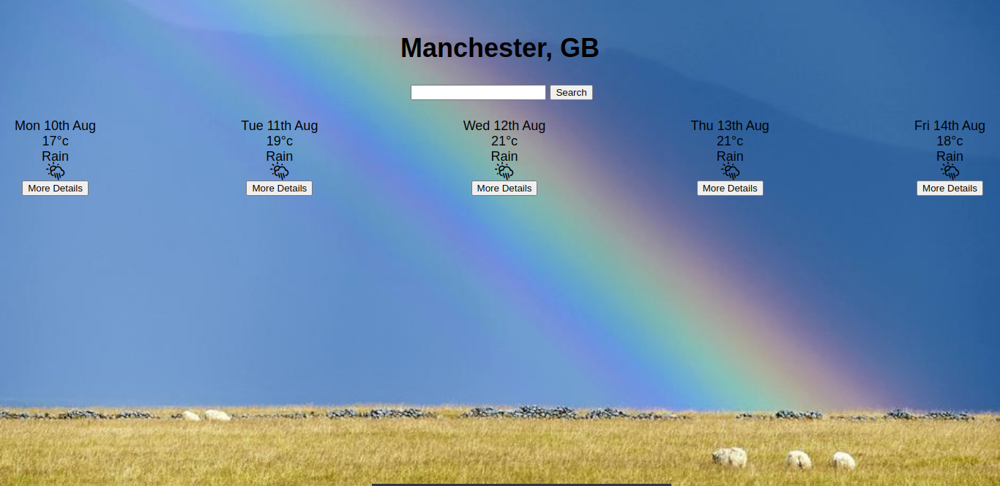

This project was bootstrapped with [Create React App](https://github.com/facebook/create-react-app).

# Weather App

This is my first React project under which I worked for two weeks practicing basics of React, function&class components and also hooks. 

## Setup

Clone my repo and open index.html. It will open a tab in your browser.

## Description

In the app you can find the forecast information for UK's locations.

## Contributing

Pull requests are welcome. For major changes, please open an issue first to discuss what you would like to change.

## Author

Created by Viktoriia Petrova as part of <a href="https://www.manchestercodes.com" target="_blank">Manchester Codes</a> learning process..

